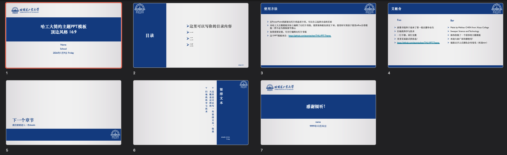
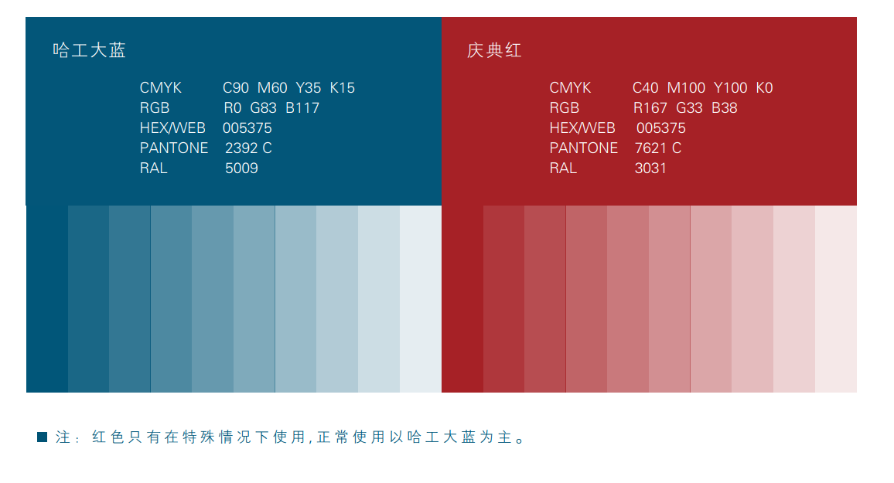
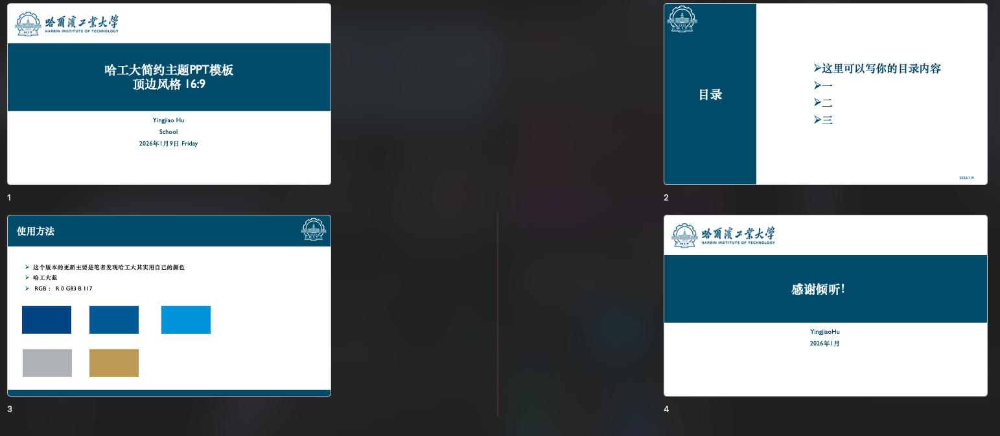

# 哈工大简约主题PPT模板

##  设计参考

本设计参考了清华大学版本[atomiechen/THU-PPT-Theme: 清华主题PPT模板 (github.com)](https://github.com/atomiechen/THU-PPT-Theme)

将颜色改为哈工大主题颜色，更换了校徽，校徽素材[素材](./素材)

## 设计效果

## 基于哈工大的 视觉识别系统里明确定义了哈工大蓝
因此更改了新版本的颜色RGB值为：
- R: 0
- G: 83
- B: 117

更改后的整体效果为如下：

可以在幻灯片母版中找到更多的版式选择

## 联系
如果有修改意见，请联系我：

yingjiaohu@qq.com or yingjiaohu@outlook.com
